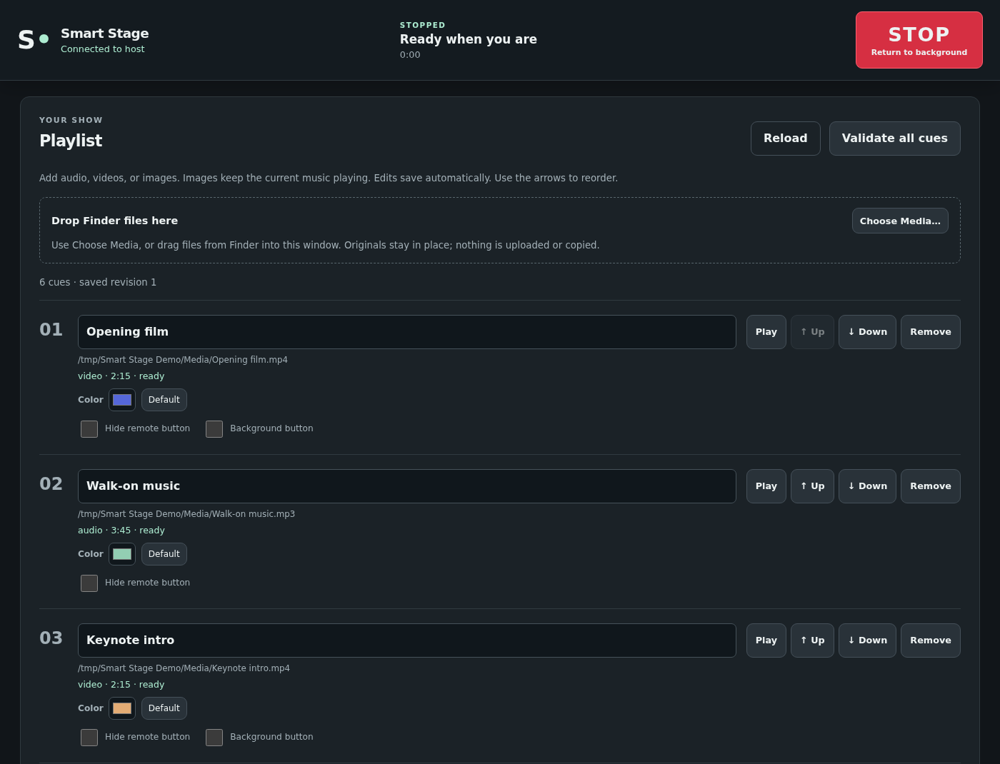
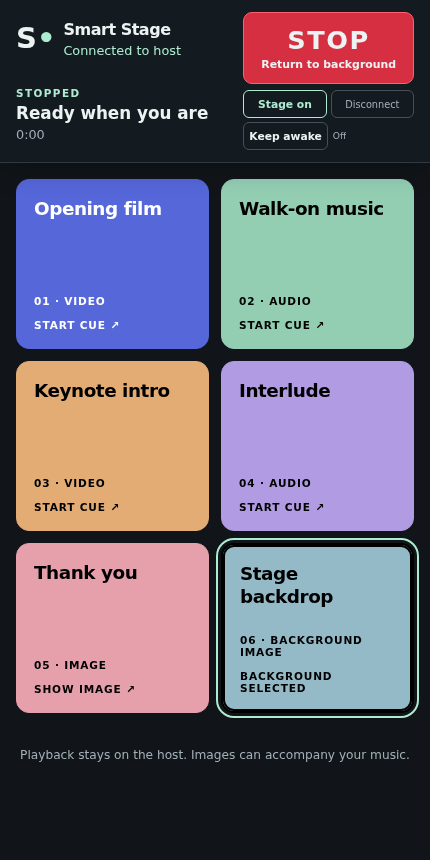

# Smart Stage

Live show control for Mac and Windows: play music, video and image cues from your phone or tablet. Build your show in the desktop app, choose your speakers and stage display, then trigger colored cue buttons remotely. Media files stay on your computer.

[Website](https://arizzi74.github.io/Smart-Stage/)

| Desktop Admin | Phone / tablet remote |
| --- | --- |
|  |  |

*Screenshots use sample show data.*

## Install

**Mac — macOS 12 or newer:** paste into Terminal:

```sh
curl -fsSL https://raw.githubusercontent.com/arizzi74/Smart-Stage/main/install.sh | sh
```

**Windows 11:** paste into a normal PowerShell window:

```powershell
irm https://raw.githubusercontent.com/arizzi74/Smart-Stage/main/install.ps1 | iex
```

Both installers detect ARM64 or Intel/AMD64, install the app and open Admin. You can close the terminal afterward. Smart Stage installs updates automatically on launch, before playback starts.

Prefer a ZIP? Download, extract and open the app. See the [manual installation notes](docs/user-guide.md#download-zips) for Mac permissions and Windows prerequisites.

| Mac | Windows |
| --- | --- |
| [Apple Silicon](https://github.com/arizzi74/Smart-Stage/releases/latest/download/smartstage-darwin-arm64.app.zip) | [ARM64](https://github.com/arizzi74/Smart-Stage/releases/latest/download/smartstage-windows-arm64.zip) |
| [Intel](https://github.com/arizzi74/Smart-Stage/releases/latest/download/smartstage-darwin-amd64.app.zip) | [Intel / AMD64](https://github.com/arizzi74/Smart-Stage/releases/latest/download/smartstage-windows-amd64.zip) |

## Start a show

1. Drop media from Finder or Explorer into Admin, or click **Choose Media…**.
2. Choose your audio output and stage display. Set cue labels, colors and an optional stage background.
3. Open **Remote control → Connection settings**. Configure your public gateway URL and token, or choose **Local network** and follow the firewall guidance.
4. Scan the QR code with your phone or tablet and tap a cue to play. **Escape** stops playback and closes the stage.

Public gateway is the default; it needs a configured server and internet access. Local LAN works without a gateway.

## Linux gateway

On your public Linux server (ARM64 or AMD64, with systemd):

```sh
curl -fsSL https://github.com/arizzi74/Smart-Stage/releases/latest/download/install-gateway.sh | sh
```

The installer offers existing nginx HTTPS sites, or Caddy if nginx is absent, and provides the URL and token for Admin. [Gateway setup](docs/gateway-install.md).

[User guide](docs/user-guide.md) · [Releases](https://github.com/arizzi74/Smart-Stage/releases) · [Known limits and verification](docs/release-verification.md)
