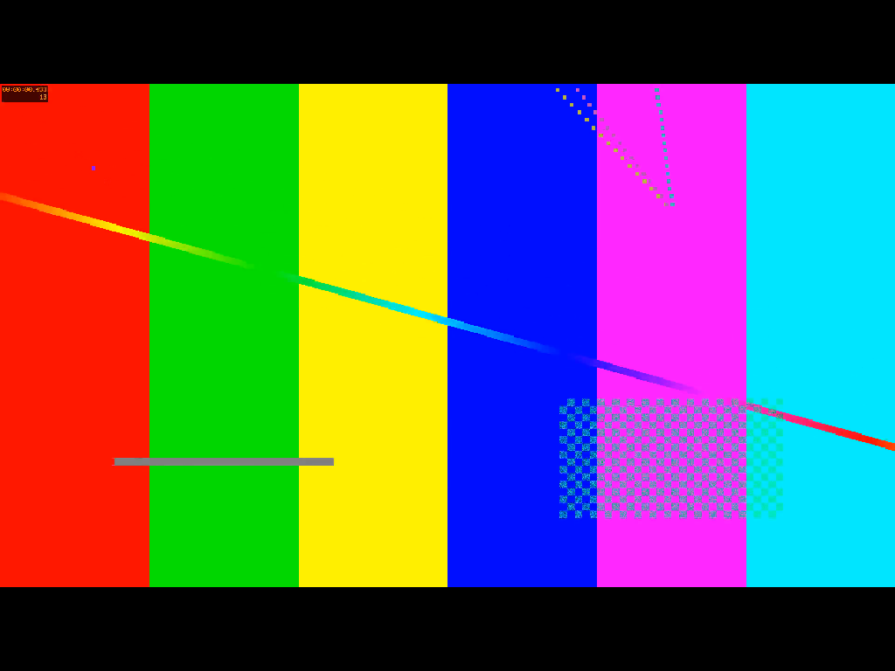
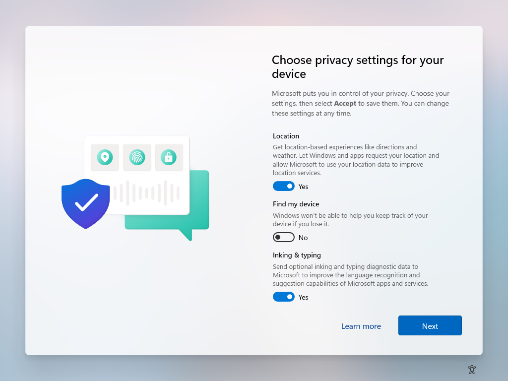

# Native display observations

These tests capture the runner's actual native desktop. They do not establish
physical projector behavior, audio routing, STOP latency or second-display
selection. Source: `505a1e495075dcc01abe6d7367d3b57d3f8e60a9`, using native
harness artifacts from [build 35478340978](https://github.com/arizzi74/Smart-Stage/actions/runs/35478340978).

[Observation 35479348242](https://github.com/arizzi74/Smart-Stage/actions/runs/35479348242)
at test source `c5c63ce` passed on both Macs and Windows AMD64, and **failed on
Windows ARM64**. The test plays the self-authored silent 1080p test pattern,
compares advancing frames, issues STOP, observes black twice, restarts video,
waits for natural completion and observes black twice again. It also checks
that STOP/end retain stage-enabled state and explicit disable clears it.

The PNG analyzer examines every pixel. Black means each color channel is at most
about 8/255. The test requires more than 99.9% black/opaque pixels; moving frames
must contain red, green and blue content and different pixel hashes. Capture
permission and desktop settings are not modified.

| Target | Captured display | Moving video/restart | STOP/end black-pixel fraction | Observation |
| --- | --- | --- | --- | --- |
| Mac AMD64 | 1920×1080 | Passed | 99.99759% | 50 nonblack pixels, all in an 8×8 box at top right |
| Mac ARM64 | 1024×768 | Passed, aspect-preserving letterbox | 99.99237% / 99.99339% | 60/52 nonblack pixels, all in an 8×8 box at top right |
| Windows AMD64 | 1024×768 | Passed, aspect-preserving letterbox | 100% | All captured stage pixels meet the black threshold |
| Windows ARM64 | 1024×768 | Unverified | Unverified | Windows privacy setup covers the captured desktop |

The Mac nonblack region is a small purple indicator, visible during both video
and blackout and consistent with the OS privacy indicator described by
[Apple](https://support.apple.com/en-my/guide/mac-help/-mchlp1446/mac).
The test does not identify which process caused it, and does not establish
that the entire display is completely black. It must not suppress OS indicators.

On Windows ARM64, `desktop-before` and the initial playing capture have identical
pixel hashes and show “Choose privacy settings for your device.” This matches
the obstruction reported in the runner image's
[issue 14069](https://github.com/actions/runner-images/issues/14069).
Read-only UI Automation context did not expose actionable privacy controls.
The observation is a failed visual test, not a passed renderer check. Native
playing/end state alone cannot resolve the missing visual evidence. No application
change or OS policy change was made from this observation.

[Read-only follow-up 35479868076](https://github.com/arizzi74/Smart-Stage/actions/runs/35479868076)
at test source `4305547` confirms that the observer and native harness share the
active console session and `Default` input desktop. Windows reports the stage
window visible, uncloaked and covering 1024×768. Captures still show the privacy
page, and the visual test still fails. The retained native window context helps
distinguish those native-window properties from pixels actually observed; it
does not establish successful rendering behind the setup screen.

Results, stage captures and failure context are retained in
[`verification/native-display-505a1e4/`](verification/native-display-505a1e4/).
The original Actions artifacts also contain desktop-before captures. The earlier
Mac-only observation used sampling; these retained results use every pixel.
Captures occur after native events and include capture overhead, so their timing
must not be reported as a measured physical STOP latency.
