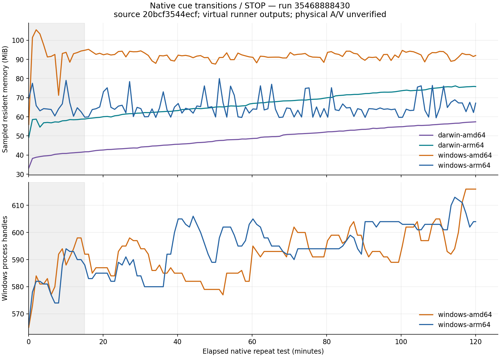

# Native soak results

**Resource stability is not yet established.** Successful state assertions do
not prove a stable native heap, physical blackout, routed sound or A/V drift.

## Earlier source: `20bcf35`

[Run 35468888430](https://github.com/arizzi74/Smart-Stage/actions/runs/35468888430)
completed successfully on all four targets. Each native repeat loop lasted at
least 7,200 seconds and saved 121 resource samples, followed by a successful
saved-show restart while stopped/stage-disabled. These results belong to
`20bcf3544ecfa7245a35098565ff564684e4e990`, not to the later published preview 3.

| Target | Completed cycles | Elapsed seconds | RSS first → final / sampled max (MiB) | Windows handles first → final / sampled max | RSS trend after minute 15 (MiB/hour) |
| --- | ---: | ---: | ---: | ---: | ---: |
| Mac AMD64 | 13,528 | 7,200.12 | 33.2 → 57.4 / 57.4 | — | +9.06 |
| Mac ARM64 | 13,611 | 7,200.37 | 49.2 → 75.8 / 76.2 | — | +9.95 |
| Windows AMD64 | 17,203 | 7,200.41 | 56.0 → 92.0 / 105.5 | 565 → 616 / 616 | −0.14 |
| Windows ARM64 | 18,322 | 7,200.16 | 69.4 → 67.1 / 80.0 | 566 → 604 / 613 | +0.30 |



Both Mac resident-memory traces continued rising after startup. Their last
15-minute medians were 56.4 MiB (AMD64) and 75.5 MiB (ARM64), compared with
42.9/60.2 MiB in minutes 15–30. This needs attribution; RSS alone cannot establish
whether memory remains live, is awaiting reclamation, or belongs to a leak.

Windows RSS varied around a relatively steady level after startup. Handle
counts also varied but ended higher. Their fitted trends after minute 15 were
approximately +10.5/+11.4 handles/hour on AMD64/ARM64. Further diagnostics are
needed before asserting that resource growth is bounded.

Mac runners used virtual/null audio and one virtual display; Windows runners
had no audio endpoints and repeated silent video only. The script checked
PLAY/replacement/STOP state and late revival after STOP. It did not observe
physical pixels, sound, A/V drift, native heap ownership or every OS handle type.

Raw per-target reports and the numerical summary are retained in
[`verification/soak-20bcf35/`](verification/soak-20bcf35/). The graph shows all
samples. The trend column is ordinary least-squares after a fixed 15-minute
startup exclusion, selected before examining this long-run data; it is not a
pass/fail threshold or a leak detector.

To regenerate the analysis with development-only Python and Matplotlib 3.10.9:

```sh
python docs/verification/analyze-soak.py \
  docs/verification/soak-20bcf35 docs/verification/soak-20bcf35 \
  --run 35468888430 --commit 20bcf3544ecfa7245a35098565ff564684e4e990
```

## Preview 3: `d70b3e2`

The exact-source [two-hour run 35471045100](https://github.com/arizzi74/Smart-Stage/actions/runs/35471045100)
is still running. The Mac native bridge is unchanged from the earlier baseline,
but the later application must retain its own result and source attribution.

[Diagnostic run 35475182913](https://github.com/arizzi74/Smart-Stage/actions/runs/35475182913)
is collecting 20 minutes of native transitions against the four **published**
preview 3 executables, with Go GC/scavenger traces and before/after OS memory
summaries. It changes no application code and is not another two-hour acceptance
run. Findings are pending.
