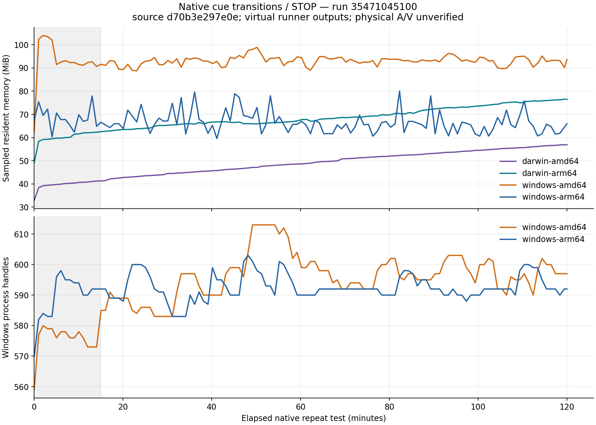

# Native soak results

**Resource stability is not yet established.** Successful state assertions do
not prove a stable native heap, physical blackout, routed sound or A/V drift.

## Earlier source: `20bcf35`

[Run 35468888430](https://github.com/arizzi74/Smart-Stage/actions/runs/35468888430)
completed successfully on all four targets. Each native repeat loop lasted at
least 7,200 seconds and saved 121 resource samples, followed by a successful
saved-show restart while stopped/stage-disabled. These results belong to
`20bcf3544ecfa7245a35098565ff564684e4e990`, not to the later published preview 3.

| Target | Completed cycles | Elapsed seconds | RSS first → final / sampled max (MiB) | Windows handles first → final / sampled max | RSS trend after minute 15 (MiB/hour) |
| --- | ---: | ---: | ---: | ---: | ---: |
| Mac AMD64 | 13,528 | 7,200.12 | 33.2 → 57.4 / 57.4 | — | +9.06 |
| Mac ARM64 | 13,611 | 7,200.37 | 49.2 → 75.8 / 76.2 | — | +9.95 |
| Windows AMD64 | 17,203 | 7,200.41 | 56.0 → 92.0 / 105.5 | 565 → 616 / 616 | −0.14 |
| Windows ARM64 | 18,322 | 7,200.16 | 69.4 → 67.1 / 80.0 | 566 → 604 / 613 | +0.30 |


Both Mac resident-memory traces continued rising after startup. Their last
15-minute medians were 56.4 MiB (AMD64) and 75.5 MiB (ARM64), compared with
42.9/60.2 MiB in minutes 15–30. This needs attribution; RSS alone cannot establish
whether memory remains live, is awaiting reclamation, or belongs to a leak.

Windows RSS varied around a relatively steady level after startup. Handle
counts also varied but ended higher. Their fitted trends after minute 15 were
approximately +10.5/+11.4 handles/hour on AMD64/ARM64. Further diagnostics are
needed before asserting that resource growth is bounded.

Mac runners used virtual/null audio and one virtual display; Windows runners
had no audio endpoints and repeated silent video only. The script checked
PLAY/replacement/STOP state and late revival after STOP. It did not observe
physical pixels, sound, A/V drift, native heap ownership or every OS handle type.

Raw per-target reports and the numerical summary are retained in
[`verification/soak-20bcf35/`](verification/soak-20bcf35/). The graph shows all
samples. The trend column is ordinary least-squares after a fixed 15-minute
startup exclusion, selected before examining this long-run data; it is not a
pass/fail threshold or a leak detector.

To regenerate the analysis with development-only Python and Matplotlib 3.10.9:

```sh
python docs/verification/analyze-soak.py \
  docs/verification/soak-20bcf35 docs/verification/soak-20bcf35 \
  --run 35468888430 --commit 20bcf3544ecfa7245a35098565ff564684e4e990
```

## Preview 3: `d70b3e2`

The exact-source [two-hour run 35471045100](https://github.com/arizzi74/Smart-Stage/actions/runs/35471045100)
completed successfully on all four targets, with 121 resource samples each and
successful saved-show restart checks. These are results for release source
`d70b3e297e0e121efc6f0800b1ffe7afe5a871d1`. The Mac native bridge is unchanged
from the earlier baseline, but this later application retains its own evidence.

| Target | Completed cycles | Elapsed seconds | RSS first → final / sampled max (MiB) | Windows handles first → final / sampled max | RSS trend after minute 15 (MiB/hour) |
| --- | ---: | ---: | ---: | ---: | ---: |
| Mac AMD64 | 13,085 | 7,200.26 | 32.9 → 56.9 / 56.9 | — | +8.76 |
| Mac ARM64 | 13,737 | 7,200.22 | 49.2 → 76.5 / 76.6 | — | +7.72 |
| Windows AMD64 | 17,756 | 7,200.08 | 62.3 → 93.6 / 104.0 | 559 → 597 / 613 | +0.47 |
| Windows ARM64 | 18,018 | 7,200.08 | 67.7 → 66.0 / 80.0 | 570 → 592 / 603 | −2.05 |



Both Mac traces again show continued resident-memory growth. Windows traces
fluctuate after startup: handle trends after minute 15 are +4.53/hour (AMD64)
and +0.71/hour (ARM64), with final 15-minute ranges of 590–602 and 590–600.
These observations do not establish stability beyond this workload and duration.
The earlier run's different Windows trends should not be merged into this run
or interpreted as a measured application improvement; their Windows audio
change was not exercised by runners without audio endpoints.

Raw reports, numerical summary and plots are in
[`verification/soak-d70b3e2/`](verification/soak-d70b3e2/). Regenerate them using
the earlier analysis command with directory `soak-d70b3e2`, run `35471045100`
and commit `d70b3e297e0e121efc6f0800b1ffe7afe5a871d1`.

[Diagnostic run 35475182913](https://github.com/arizzi74/Smart-Stage/actions/runs/35475182913)
completed 20 minutes of native transitions against each of the four **published**
preview 3 executables, with Go GC/scavenger traces and before/after OS memory
summaries. Application commit: `d70b3e2`; diagnostic workflow commit: `34927b4`.
It changes no application code and is not another two-hour acceptance run.

| Target | Cycles | Native malloc allocations before → after | Native allocated KiB before → after | Go live heap at final GC, rounded MiB |
| --- | ---: | ---: | ---: | ---: |
| Mac AMD64 | 2,145 | 22,568 → 54,651 | 3,692 → 7,080 | 1 |
| Mac ARM64 | 2,268 | 22,923 → 56,561 | 3,408 → 6,923 | 1 |

The Mac malloc allocation count increased by roughly 15 allocations per cycle,
with about 1.6 KiB more allocated bytes per cycle. Both Go traces contained 48
collections, with reported post-GC live heap at 0–1 MiB. This implicates native
allocation retention rather than growth in the live Go heap, but it does not
identify which native objects retained those allocations.

Windows Go live heap also ended at 1 MiB. Separate process snapshots showed
552 → 571 handles and 24 → 21 threads on AMD64; 554 → 604 handles and 24 → 25
threads on ARM64. Snapshots are taken separately from the continuous RSS/handle
samples. The increased handle count therefore cannot simply be explained by
more live threads. [Run 35476607468](https://github.com/arizzi74/Smart-Stage/actions/runs/35476607468)
completed per-type handle counts and two minutes of stopped idle samples
against the same published executables, using Microsoft's signed
[Handle 5.0](https://learn.microsoft.com/en-us/sysinternals/downloads/handle)
diagnostic tool in summary mode. It does not close or modify application handles.

| Target | Total handles before → after 20 minutes → after two idle minutes | Event handles | Thread handles | I/O completion handles | File handles |
| --- | --- | --- | --- | --- | --- |
| Windows AMD64 | 548 → 579 → 558 | 90 → 107 → 98 | 27 → 37 → 29 | 16 → 20 → 16 | 20 → 20 → 20 |
| Windows ARM64 | 558 → 591 → 569 | 92 → 110 → 100 | 28 → 38 → 31 | 17 → 21 → 16 | 19 → 19 → 19 |

Both loops completed at least 1,200 seconds (2,782/3,012 cycles). During stopped
idle, resident memory fell from 93.8 to 43.0 MiB on AMD64 and 59.3 to 29.5 MiB
on ARM64; those values are the initial/final idle samples, not the separate
end-of-loop samples. Live thread counts fell from 21 to 14 and 25 to 17;
open thread handles are a different count. Registry-key, semaphore and section
counts were unchanged across all three handle snapshots. Total handles ended
10/11 above the initial snapshots, so full return to initial counts was not
observed. These data show substantial delayed cleanup and no per-cycle file
handle growth in this workload. They do not identify the owner of every retained
handle or prove that all workloads are leak-free. No Windows code change was
made from these observations.

Raw per-type counts, signed-tool provenance, process/GC reports and the parsed
summary are retained in
[`verification/windows-handles-d70b3e2/`](verification/windows-handles-d70b3e2/).

Raw GC traces, OS summaries, application reports and the parsed numerical
summary are retained in
[`verification/memory-profile-d70b3e2/`](verification/memory-profile-d70b3e2/).
The OS tools round displayed sizes; derived byte values are approximate.
Regenerate the summary with development-only Python:

```sh
python docs/verification/analyze-memory-profile.py \
  docs/verification/memory-profile-d70b3e2 --run 35475182913 \
  --application-commit d70b3e297e0e121efc6f0800b1ffe7afe5a871d1 \
  --workflow-commit 34927b483f3c4fce7f3291a5457274e82990858f
```

## Candidate Mac cleanup change: `67a10d2`

Review found that main-queue control/AVFoundation work and synchronous screen
enumeration had no explicit local autorelease pools. The Go caller's pool
belongs to another thread. [Apple documents](https://developer.apple.com/library/archive/documentation/General/Conceptual/ConcurrencyProgrammingGuide/OperationQueues/OperationQueues.html)
that dispatch queues do not guarantee when their autorelease pools drain.
The candidate adds pools around those operations and native event callbacks;
retained playback state, queued event data and the screen result survive through
their existing strong references.

[Run 35476510349](https://github.com/arizzi74/Smart-Stage/actions/runs/35476510349)
completed the same 20-minute diagnostic on both Mac architectures. **The pool
change did not reduce the retained allocation growth.** Playback/state checks
passed, but native malloc counts still rose by roughly 15 allocations per cycle:

| Target | Cycles | Native malloc allocations before → after | Increase per cycle | Native allocated KiB before → after |
| --- | ---: | ---: | ---: | ---: |
| Mac AMD64 | 2,226 | 22,602 → 55,699 | 14.87 | 3,680 → 7,124 |
| Mac ARM64 | 2,279 | 22,921 → 56,392 | 14.69 | 3,388 → 6,903 |

Live Go heap again ended at a reported 1 MiB. Raw candidate reports and parsed
results are retained in
[`verification/memory-profile-67a10d2/`](verification/memory-profile-67a10d2/).
Published preview 3 remains unchanged; no fixed-memory claim is justified.

[Heap attribution run 35477482621](https://github.com/arizzi74/Smart-Stage/actions/runs/35477482621)
uses the same application source with debug symbols, `MallocStackLogging=1`,
and before/after `heap -sortBySize -noContent` summaries over five minutes.
Both targets completed. The application playback objects did not accumulate
in the stopped heap snapshots, but Core Media timebases and caption-renderer
timers/triggers did:

| Target | Cycles | FigTimebase count before → after | FigCaptionRendererTrigger | FigCaptionRendererTimer |
| --- | ---: | ---: | ---: | ---: |
| Mac AMD64 | 545 | 4 → 440 | 2 → 220 | 3 → 221 |
| Mac ARM64 | 596 | 4 → 480 | 2 → 240 | 3 → 241 |

There was one persistent player layer and one caption-renderer session in both
snapshots on each Mac. Autorelease-pool storage stayed at four pages on both.
These class counts suggest investigating the video layer's retained rendering
state; they are not a full reference-ownership graph. Additional retained
libdispatch/Core Audio objects were also present. This instrumented memory use
must not be treated as a release stability result. Raw snapshots and all parsed
class deltas are retained in
[`verification/heap-350bc5c/`](verification/heap-350bc5c/).

## Candidate renderer lifetime change: `ae439c8`

The candidate releases the video player layer during playback teardown and
creates a fresh layer below the existing black overlay when needed. The native
stage window and opaque overlay remain present across STOP. KVO and playback
observers are removed before the renderer is released.

[Heap comparison 35477893688](https://github.com/arizzi74/Smart-Stage/actions/runs/35477893688)
and [native regression run 35477893782](https://github.com/arizzi74/Smart-Stage/actions/runs/35477893782)
are running. No memory-fix claim or updated release has been made yet.
